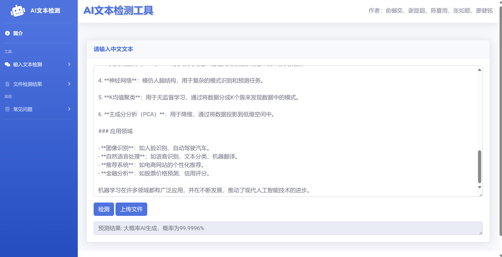

# AI-Generated Text Detection Based on Pre-trained Models

This project aims to detect AI-generated texts using pre-trained models. By leveraging various pre-trained models, we can effectively distinguish between AI-generated and human-written texts.

## Pre-trained Models
- **BERT**: Supports both Chinese and English text recognition.
- **RoBERTa**: Supports both Chinese and English text recognition.
- **GPT-2**: Supports only English text recognition.

## Installation
Make sure you have a Python 3 environment and install the required dependencies:
```bash
pip install Flask Flask-Cors pymupdf torch transformers
```
or
```bash
pip install -r requirements.txt
```

## Usage
1. **Download Pre-trained Models**:
   Please download the three pre-trained open-source models from the following link:
   [Pre-trained Models Download Link](https://rec.ustc.edu.cn/share/436a8ce0-15db-11ef-b9aa-391d78e4e304).

2. **Run Training Scripts**:
   Use the downloaded pre-trained models to run the training scripts and generate your own detection model. The training scripts are located in the `Train-And-Test` folder in the project root directory, with the prefix `AI_detection_`.

3. **Import the Trained Model in `main.py`**:
   Import the trained detection model into `main.py` for the text detection task.

4. **Run Frontend and Backend**:
   - Open `index.html` as the frontend page.
   - Run `main.py` as the backend service.
   ```bash
   python main.py
   ```
The text formats supported are `.pdf` and `.txt`. The final result is shown in the image below.


## Contribution
We welcome any form of contribution. Please participate by submitting issues or pull requests.

## License
This project is licensed under the MIT License. See the `LICENSE` file for details.


## Authors
- Yueyi Yu
- Xuanchao Xie
- Xiayu Chen
- Rushun Zhang
- Jianming Liao
